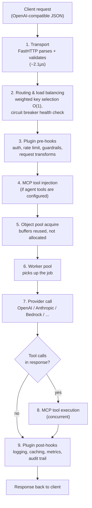

# What Is Bifrost, and Why Is It So Fast?

## What Bifrost is

Bifrost is an open-source (Apache 2.0) AI gateway built by Maxim AI. It sits between your application and the LLM providers you call — OpenAI, Anthropic, AWS Bedrock, Google Vertex, Azure, Groq, Mistral, Cohere, Ollama, and 15+ others (23+ providers total, 1000+ models) — and exposes all of them through **one OpenAI-compatible API**. Your code talks to Bifrost the same way it would talk to OpenAI; which provider actually serves the request is a routing decision Bifrost makes, not something your application needs to know.

Three ways to run it:

- **Gateway (HTTP API)** — a standalone process (Docker, NPX, or a single binary) with a Web UI, REST API, and config file. Language-agnostic — any HTTP client can use it. This is how our [bifrost_experiment.ipynb](../bifrost_experiment.ipynb) notebook uses it.
- **Go SDK** — embed Bifrost directly inside a Go service instead of running it as a separate process.
- **Drop-in replacement** — point an existing OpenAI/Anthropic SDK at Bifrost's base URL and change nothing else.

The core pitch is simple: instead of writing separate error handling, retry logic, and client code for every provider, you write it once against Bifrost, and Bifrost absorbs the differences between providers.

## Why "ultrafast" is a real claim, not marketing

Bifrost's headline number is **11 microseconds of added latency at 5,000 requests/second** (on an AWS t3.xlarge). The comparison point the project measures itself against is **LiteLLM**, the most widely used open-source alternative, which is written in Python.

That comparison is where the speed claim actually comes from, and it's architectural, not incidental:

| | Bifrost | LiteLLM |
|---|---|---|
| Language / runtime | Go — compiled, native concurrency via goroutines | Python — GIL-bound, asyncio overhead under concurrent load |
| P50 latency @ 500 RPS | 804 ms | 38.65 s |
| P99 latency @ 500 RPS | 1.68 s | 90.72 s |
| Throughput | 424 req/s | 44.84 req/s |
| Memory | 120 MB | 372 MB |
| Success rate | 100% | 88.78% |
| Gateway overhead (isolated) | 0.99 ms | 40 ms |

*(500 concurrent virtual users, 60s duration, AWS t3.medium, 60ms mocked upstream response — [Bifrost vs LiteLLM benchmark](https://www.getmaxim.ai/bifrost/resources/benchmarks).)*

At higher load the gap gets more dramatic, not less: at 1,000 RPS LiteLLM runs out of memory and crashes, while Bifrost keeps a P99 of ~1.2s. At Bifrost's own stress ceiling — 5,000 RPS with ~10KB responses on a t3.xlarge — it holds 11µs of overhead and a 100% success rate.

**Where that speed actually comes from**, mechanically:

1. **Go instead of Python.** No GIL. Concurrent requests run on real OS threads via goroutines instead of contending for a single interpreter lock.
2. **`FastHTTP` transport.** Request parsing is measured in low single-digit microseconds (~2.1µs) rather than going through a general-purpose Python web framework.
3. **O(1) key/provider selection.** Weighted random selection across API key pools is a constant-time operation (~10ns) — routing decisions don't get slower as you add more keys or providers.
4. **Object pooling.** Channels, message buffers, and response objects are pre-allocated and reused instead of being garbage-collected on every request — this is most of why memory usage stays flat under load instead of growing with LiteLLM's Python object churn.
5. **Circuit breakers instead of blocking retries.** A failing provider is marked unhealthy and skipped, rather than every in-flight request individually timing out against it.
6. **Worker pools.** A fixed pool of workers pulls jobs off a queue rather than spawning unbounded goroutines/threads per request.

## Request flow

Every request through the Bifrost gateway moves through the same nine-stage pipeline:

If the primary provider fails (5xx, 429, or 401) or is marked unhealthy by the circuit breaker, step 2 re-routes to a configured fallback model/provider before the request ever reaches step 6 — this is the mechanism behind the failover feature shown in [Section 3.2](../bifrost_experiment.ipynb) of the notebook.

## Why this matters in practice, not just in benchmarks

A gateway that adds 40ms+ of its own overhead is invisible at low request volume — nobody notices an extra 40ms on a 2-second LLM call. It stops being invisible the moment you're running many concurrent agents, a production chat product, or anything doing high-frequency tool-calling loops, where the gateway's own tax gets paid on every single hop. Bifrost's architecture is specifically aimed at keeping that tax close to zero even as concurrency scales — which is the actual, practical meaning behind "50x faster than LiteLLM."

## Sources

- [GitHub — maximhq/bifrost](https://github.com/maximhq/bifrost)
- [Bifrost vs LiteLLM Benchmarks](https://www.getmaxim.ai/bifrost/resources/benchmarks)
- [Bifrost: A Drop-in LLM Proxy, 50x Faster Than LiteLLM](https://www.getmaxim.ai/blog/bifrost-a-drop-in-llm-proxy-40x-faster-than-litellm/)
- [Bifrost docs — Request Flow](https://docs.getbifrost.ai/architecture/core/request-flow)
- [Bifrost docs — Plugins](https://docs.getbifrost.ai/architecture/core/plugins)
