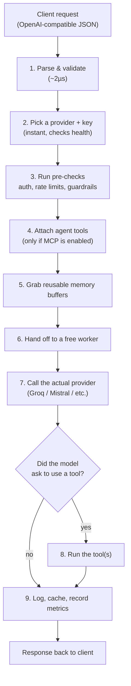

# What Is Bifrost, and Why Is It So Fast?

*Terms you don't recognize below are in [00-terminologies.md](00-terminologies.md).*

## What Bifrost is

Bifrost is a free, open-source gateway that sits between your app and the LLM providers you use — Groq, Mistral, OpenAI, Anthropic, and 20+ others. Instead of your code talking to each provider separately, it talks to Bifrost once, using one consistent API. Bifrost figures out which provider actually handles the request.

Picture the RAG pipeline in Section 4 of our notebook: the final step, `rag_query()`, calls `bifrost_call(prompt, model)`. That one function can send the request to Groq or to Mistral just by changing the `model` string — nothing else in the RAG code changes. That's the whole point of a gateway: your application logic stays provider-agnostic.

You can run Bifrost three ways:

- **As a gateway (HTTP API)** — a standalone Docker container or binary with a Web UI. This is what our notebook uses.
- **As a Go SDK** — embedded directly inside a Go service, no separate process.
- **As a drop-in replacement** — point your existing OpenAI SDK at Bifrost's URL and change nothing else in your code.

## Why "ultrafast" isn't just marketing

Bifrost's headline number: it adds only **11 microseconds** of its own delay per request, even at 5,000 requests/second. The comparison point is **LiteLLM**, the most popular open-source alternative, which is written in Python.

That gap comes down to one core difference: Bifrost is written in Go, LiteLLM in Python. Here's what that actually looks like in numbers, from a real benchmark (500 concurrent users, 60s, same hardware, same fake upstream response):

| | Bifrost | LiteLLM | Difference |
|---|---|---|---|
| Median latency (P50) | 804 ms | 38.65 s | 48x faster |
| Worst-case latency (P99) | 1.68 s | 90.72 s | 54x faster |
| Requests handled per second | 424 | 44.84 | 9.5x more |
| Memory used | 120 MB | 372 MB | 68% less |
| Requests that succeeded | 100% | 88.78% | — |

*([Full benchmark](https://www.getmaxim.ai/bifrost/resources/benchmarks).)* Push the load even higher and the gap gets worse for LiteLLM, not better — at 1,000 RPS it runs out of memory and crashes, while Bifrost stays stable. At Bifrost's own stress test (5,000 RPS, bigger ~10KB responses), it's still holding 11µs of overhead with zero failed requests.

**What actually causes this, in plain terms:**

1. **Go vs. Python.** Python has a rule (the GIL) that only lets one thread run Python code at a time, even on a machine with 16 cores. Go doesn't have that limitation — it can genuinely do many things at once.
2. **A faster way of reading requests.** Bifrost parses an incoming request in about 2 microseconds, using a stripped-down, high-speed HTTP layer instead of a general-purpose Python web framework.
3. **Picking a provider key is instant, no matter how many you have.** Whether you've configured 1 API key or 50, choosing which one to use takes the same tiny amount of time (~10 nanoseconds).
4. **It reuses memory instead of constantly allocating new memory.** Every request doesn't create a pile of garbage for the system to clean up later — buffers get reused. This is a big reason memory usage stays flat under load instead of climbing.
5. **A broken provider gets skipped, not retried into oblivion.** If Groq starts failing, Bifrost notices and stops sending it traffic for a bit, instead of every single request individually waiting and timing out against it.
6. **A fixed set of workers handles the load**, rather than spinning up unlimited threads that eventually overwhelm the machine.

## What actually happens to a request

Every call through Bifrost goes through the same nine steps:

Two concrete examples of this pipeline in our notebook:

- **The RAG answer call (Section 4.4)** — `rag_query()` builds a prompt with the retrieved Qdrant context, then calls `bifrost_call()`. That request flows through steps 1–3, skips step 4 entirely (no MCP tools involved), then goes straight to the provider and back.
- **The agent demo (Section 3.8)** — asking "search the web for Groq news" *does* use step 4 (Tavily gets attached as an available tool) and step 8 (the tool actually runs, because Auto-execute is turned on) before the model can give its final answer.

If the primary provider fails or is unhealthy, step 2 is where Bifrost quietly switches to your configured fallback — before the request ever reaches a worker. That's the mechanism behind the failover demo in Section 3.2.

## Why the speed actually matters

A gateway adding 40ms of its own delay is invisible if your whole request already takes 2 seconds — nobody notices. It stops being invisible the moment you're running an **agent** that calls the LLM 4 or 5 times in a loop for one user question (plan → search → re-plan → answer): now that 40ms gets paid on every single hop, and it compounds. Bifrost's whole design is aimed at keeping that per-hop tax close to zero, which is the real, practical meaning behind "50x faster than LiteLLM" — it matters most exactly where agentic and high-traffic systems live.

## Sources

- [GitHub — maximhq/bifrost](https://github.com/maximhq/bifrost)
- [Bifrost vs LiteLLM Benchmarks](https://www.getmaxim.ai/bifrost/resources/benchmarks)
- [Bifrost: A Drop-in LLM Proxy, 50x Faster Than LiteLLM](https://www.getmaxim.ai/blog/bifrost-a-drop-in-llm-proxy-40x-faster-than-litellm/)
- [Bifrost docs — Request Flow](https://docs.getbifrost.ai/architecture/core/request-flow)
- [Bifrost docs — Plugins](https://docs.getbifrost.ai/architecture/core/plugins)
