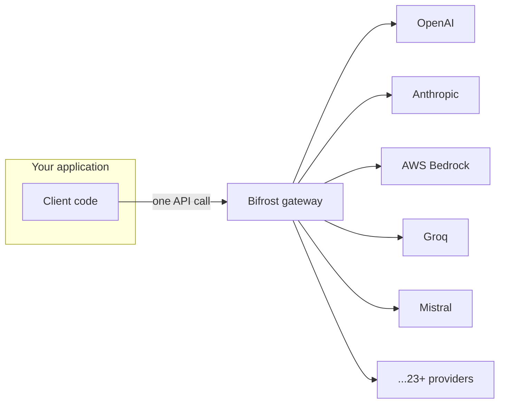

# Bifrost Features, How It Differs From Other Gateways, and When to Choose It

*Terms you don't recognize below are in [00-terminologies.md](00-terminologies.md).*

## What Bifrost actually gives you

**Get to more than one provider, one way**
- One API in front of 23+ providers and 1000+ models
- Automatic failover — if Groq errors out (5xx/429/401), the request quietly retries on Mistral instead of failing. It does *not* fail over on a 404 (a typo'd model name), since that's your bug, not the provider's outage — see Section 3.2.
- Weighted load balancing across multiple keys for the same provider, so you're not capped by one key's rate limit
- Drop-in replacement — swap a base URL, keep your existing OpenAI SDK code exactly as-is

**Built for agents**
- MCP gateway — one place to register tools (web search, a database, DeepWiki, Tavily) so every agent behind Bifrost shares the same governed tool access, instead of every app team wiring up its own MCP client from scratch. This is exactly what Section 3.7's demo uses.
- MCP "Code Mode" — describes tools to the model as short TypeScript signatures instead of bulky JSON, saving tokens once an agent has a lot of tools to pick from
- Semantic caching — recognizes when two questions mean the same thing (like `duplicate1`/`duplicate2` in the notebook) and reuses the answer instead of calling the LLM twice
- Custom plugin system — write your own pre/post hooks in Go for auth, logging, transforms, or mocking

**Lets you see what's happening**
- Built-in dashboard and Logs API, Prometheus metrics, OpenTelemetry support, distributed tracing

**Lets you control who spends what** *(depth varies by tier — see [doc 03](03-oss-vs-enterprise.md))*
- Virtual keys with budgets and rate limits per team/customer/key
- SSO, role-based access control, and audit logs on the Enterprise tier

**Easy to actually run**
- Zero-config startup via Docker/NPX, Web UI or config-file driven, a CLI, and native support for popular frameworks like LangChain and the Vercel AI SDK

## How it's architecturally different from the alternatives

| | **Bifrost** | **LiteLLM** | **Portkey** | **Kong AI Gateway** |
|---|---|---|---|---|
| Built in | Go — no GIL, real concurrency | Python | Managed SaaS | Extension of Kong's existing core |
| Can you self-host it? | Yes, that's the whole design | Yes | No, hosted only | Yes, but production use needs an enterprise license |
| Speed at scale | ~11µs overhead @ 5,000 RPS | Overhead climbs sharply under load (40ms+) | 20–40ms, heavier due to compliance features | Faster than Portkey, but not purpose-built for LLM traffic |
| Agent/MCP support | Built in, with governance | None | None | Limited, less mature |
| Guardrails & semantic caching | Enterprise add-on, first-party | Paid tier | First-party, but locks you into Portkey's infra | Less mature than dedicated LLM gateways |
| Where it fits best | Teams that want to self-host, need speed at real scale, and want a path to enterprise-grade governance later | Python teams prototyping fast, want the widest provider list | Teams that don't want to run any infrastructure themselves | Orgs already standardized on Kong for their APIs |

## When Bifrost is the right call

- **You need to self-host.** Data residency, compliance, or simply not wanting a third party sitting in the middle of every LLM call.
- **You're running real traffic — many concurrent requests, or agents making several LLM calls per user turn.** This is exactly where LiteLLM's Python overhead starts to hurt, and where Bifrost's Go core doesn't.
- **You're building agents and want tool access governed centrally**, instead of every team building its own one-off MCP integration.
- **You want to start free and grow into enterprise features** (SSO, guardrails, vault integration) without switching gateways later.

## When something else fits better

- **You don't want to run any infrastructure, period**, and you're fine with a vendor holding your traffic — Portkey or OpenRouter get you there faster.
- **You're already fully invested in Kong** for general API management, and your LLM traffic is light — extending Kong avoids standing up a second gateway.
- **You're an early-stage Python team just prototyping**, and provider breadth matters more than raw performance right now — LiteLLM's catalog is the widest of the open-source options.

## Sources

- [GitHub — maximhq/bifrost README](https://github.com/maximhq/bifrost/blob/main/README.md)
- [Bifrost | Enterprise AI Gateway Built for Scale](https://www.getmaxim.ai/bifrost)
- [Top 5 LLM Gateways in 2026: A Production-Ready Comparison](https://www.getmaxim.ai/articles/top-5-llm-gateways-in-2026-a-production-ready-comparison/)
- [Bifrost vs Kong AI Gateway — Performance, Pricing, and Enterprise Features Compared](https://dev.to/pranay_batta/bifrost-vs-kong-ai-gateway-performance-pricing-and-enterprise-features-compared-2170)
