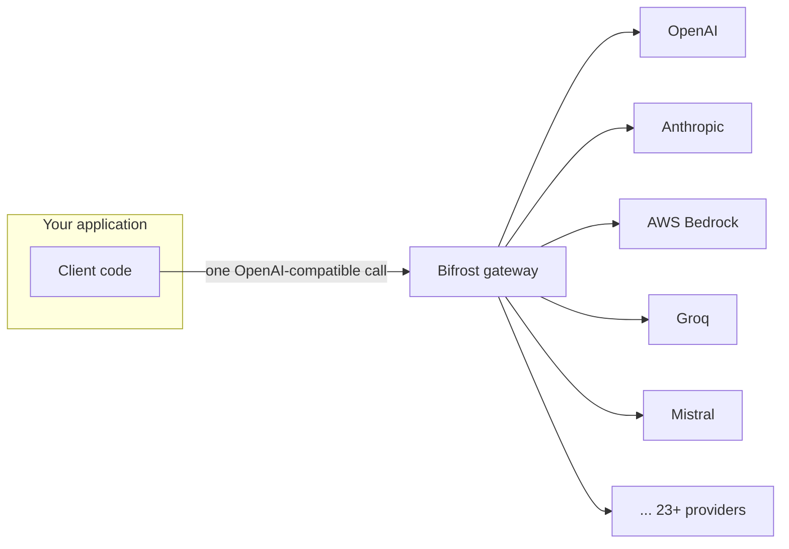

# Bifrost Features, How It Differs From Other Gateways, and When to Choose It

## Full feature set

**Core infrastructure**
- Single OpenAI-compatible API in front of 23+ providers / 1000+ models
- Automatic failover between providers and models on 5xx / 429 / 401 (not on 404 — a missing model is treated as a client error, not a reason to fail over; see [Section 3.2](../bifrost_experiment.ipynb) of the notebook)
- Weighted load balancing across multiple API keys for the same provider (raise your effective rate limit by spreading traffic)
- Drop-in replacement — swap the base URL of an existing OpenAI/Anthropic SDK, keep the rest of your code

**Advanced capabilities**
- MCP gateway — a centralized place to register tool servers (filesystem, web search, databases, DeepWiki, Tavily, etc.) so every agent behind Bifrost shares the same governed tool access instead of every app wiring up its own MCP clients
- MCP "Code Mode" — generates TypeScript tool declarations instead of verbose JSON schemas, cutting token overhead when an agent has many tools available
- Semantic caching — cache responses by meaning, not exact string match, to cut cost and latency on repeated/near-duplicate queries
- Multimodal support — text, images, audio, streaming
- Custom plugin system (Go) — pre/post request hooks for auth, transforms, logging, mocking

**Observability**
- Built-in Web UI dashboard, Logs API, native Prometheus metrics
- OpenTelemetry / OTLP support
- Distributed tracing

**Governance & access control (varies by tier — see [doc 03](03-oss-vs-enterprise.md))**
- Virtual keys with hierarchical budgets (team / customer / key level) and rate limits
- Role-based access control, SAML/OIDC SSO
- Audit logs

**Developer experience**
- Zero-config startup — Docker/NPX, no mounted config required to get going
- Web UI, REST API, or config-file driven setup
- CLI, native support for popular AI SDKs and frameworks (LangChain, Vercel AI SDK, etc.)

## How Bifrost differs architecturally from the other major gateways

| | **Bifrost** | **LiteLLM** | **Portkey** | **Kong AI Gateway** |
|---|---|---|---|---|
| Runtime | Go (compiled, no GIL) | Python | Managed SaaS | Extension of Kong's Lua/Go core |
| Self-hostable | Yes — core design goal | Yes | No — hosted only | Yes, but production self-host needs an enterprise license |
| Overhead at scale | ~11µs @ 5,000 RPS | 40ms+, degrades sharply under load | 20–40ms (compliance features add cost) | Lower latency than Portkey, but not purpose-built for LLM traffic |
| MCP gateway | Built in, with governance | No | No | Limited / less mature |
| Guardrails & semantic caching | Enterprise add-on, first-party | Paid tier | First-party, but tied to Portkey's infra (lock-in) | Less mature than dedicated LLM gateways |
| Best existing fit | Teams that want self-hosted + high throughput + a path to enterprise governance | Python teams prototyping, want the widest provider catalog | Teams that don't want to run any infrastructure themselves | Organizations already standardized on Kong for REST APIs |

## When to choose Bifrost

Choose Bifrost when any of these apply:

- **You need self-hosting.** Data residency, compliance, or just not wanting a third party in the request path for every LLM call.
- **You're running high request volume or many concurrent agents.** This is where LiteLLM's Python overhead becomes visible and Bifrost's Go core doesn't.
- **You want MCP tool governance built in**, instead of every application team wiring up its own tool integrations with no shared control.
- **You want an open-source core with a real upgrade path** — start free and self-hosted, add enterprise governance (SSO, guardrails, vault integration) later without re-architecting.
- **You're doing agentic / tool-calling workloads** where gateway latency compounds across many hops in a single agent turn.

Choose something else when:

- **You don't want to operate any infrastructure at all** and are fine with a managed vendor holding your traffic — Portkey or OpenRouter are a more direct fit.
- **You're already deeply invested in Kong** for general API management and only need light LLM routing — extending Kong avoids a second gateway to operate.
- **You're an early-stage Python shop just prototyping** and provider breadth matters more than performance right now — LiteLLM's catalog is the widest of the open-source options.

## Sources

- [GitHub — maximhq/bifrost README](https://github.com/maximhq/bifrost/blob/main/README.md)
- [Bifrost | Enterprise AI Gateway Built for Scale](https://www.getmaxim.ai/bifrost)
- [Top 5 LLM Gateways in 2026: A Production-Ready Comparison](https://www.getmaxim.ai/articles/top-5-llm-gateways-in-2026-a-production-ready-comparison/)
- [Bifrost vs Kong AI Gateway — Performance, Pricing, and Enterprise Features Compared](https://dev.to/pranay_batta/bifrost-vs-kong-ai-gateway-performance-pricing-and-enterprise-features-compared-2170)
