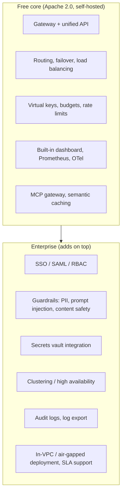

# Bifrost Free (Self-Hosted) vs. Bifrost Enterprise

*Terms you don't recognize below are in [00-terminologies.md](00-terminologies.md).*

## The distinction that actually matters

This is **not** "self-hosted vs. hosted for you." You can self-host both tiers. Enterprise adds deployment flexibility (isolated VPC, air-gapped, multi-cloud) plus a set of features gated behind a paid license, on top of the same open-source (Apache 2.0) core.

So the real question, feature by feature, is: *is this part of the free gateway, or is it a paid add-on?*

## Full comparison

| Category | Capability | Free | Enterprise |
|---|---|:---:|:---:|
| **Core gateway** | Single API, drop-in replacement, routing, fallbacks | ✅ | ✅ |
| **Seeing what's happening** | Dashboard, Logs API, Prometheus, OpenTelemetry | ✅ | ✅ |
| | Exporting logs to your own tools (SIEM, compliance systems) | ❌ | ✅ |
| **Controlling spend & access** | Virtual keys, budgets, rate limits | ✅ | ✅ |
| | Login through your company's SSO (SAML/OIDC) | ❌ | ✅ |
| | Role-based permissions (who can do what) | ❌ | ✅ |
| | Audit logs for compliance | ❌ | ✅ |
| **Keeping secrets safe** | Env-var based secrets | ✅ | ✅ |
| | Storing keys in a proper vault (HashiCorp, AWS, GCP, Azure) | ❌ | ✅ |
| **Checking content is safe** | Guardrails: catching PII, prompt injection, unsafe content, hallucinations | ❌ | ✅ |
| **Staying up under load** | Basic failover & load balancing | ✅ | ✅ |
| | Multi-node clustering for high availability | ❌ | ✅ |
| | Traffic auto-tuned to real-time performance | ❌ | ✅ |
| **Agent tooling** | MCP gateway, code mode, tool filtering | ✅ | ✅ |
| | Per-team/per-identity tool permissions | ❌ | ✅ |
| **Support** | Community (Discord) | ✅ | ❌ |
| | Guaranteed support response times (SLA) | ❌ | ✅ |

## What this means in practice

Our `bifrost_experiment.ipynb` setup — one Docker container, Groq + Mistral, no company SSO, no compliance requirement — **uses nothing outside the free tier**: virtual keys, MCP gateway, failover, load balancing, built-in observability all work exactly as shown, for free.

Where teams actually start paying for Enterprise, in practice:

1. **A regulator or auditor is asking questions.** You need audit trails and content-safety checks that hold up as real evidence, not just app logs.
2. **More than one team uses the gateway.** You need real SSO and role-based access, not everyone sharing one login.
3. **Downtime is expensive.** You need multi-node failover for the gateway itself, plus a support contract with a guaranteed response time.
4. **Provider keys need to live somewhere safer than an `.env` file** — once multiple teams touch the gateway, a proper secrets vault stops being optional.

### A concrete RAG example of where the line falls

Say you extend Section 4's RAG pipeline into a real product: customer support tickets get embedded and stored in Qdrant, and support agents query them through Bifrost.

- **Free tier is enough if:** it's your team only, you control what goes into the knowledge base, and you just want to track spend per environment (dev vs. prod) using virtual key budgets.
- **You need Enterprise once:** the tickets contain customer PII (emails, order numbers, phone numbers) and you need those *redacted before they ever reach the model* — that's a guardrail, not a budget control. Or once support and engineering both need access but shouldn't see each other's virtual keys — that's RBAC, not something budgets alone solve.

None of this is about speed — the full routing and performance engine from [doc 01](01-what-is-bifrost.md) is already in the free tier. Enterprise is priced around *governance, compliance, and support*, not throughput.

## Sources

- [Bifrost Pricing — OSS and Enterprise](https://www.getmaxim.ai/bifrost/pricing)
- [Bifrost Enterprise — AI Gateway Built for Scale](https://www.getmaxim.ai/bifrost/enterprise)
- [Enterprise AI Gateway Deployment — In-VPC, Air-Gapped, Multi-Cloud](https://www.getmaxim.ai/bifrost/resources/enterprise-deployment)
