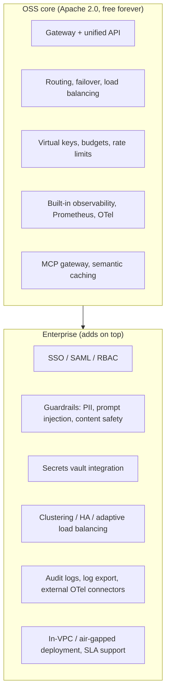

# Bifrost OSS (Self-Hosted, Free) vs. Bifrost Enterprise

## The framing that actually matters

This isn't "self-hosted vs. hosted." **Both tiers are self-hostable** — Enterprise doesn't take away your ability to run Bifrost on your own infrastructure; it adds deployment flexibility (VPC-isolated, air-gapped, multi-cloud) plus a set of features that are gated behind a commercial license rather than shipped under the Apache 2.0 core.

So the real question per feature is: *is this part of the open-source gateway, or is it a paid add-on on top of it?*

## Full comparison

| Category | Capability | OSS (Free) | Enterprise |
|---|---|:---:|:---:|
| **Core gateway** | Single OpenAI-compatible API | ✅ | ✅ |
| | Drop-in replacement | ✅ | ✅ |
| | Custom routing rules & flows | ✅ | ✅ |
| | Automatic fallbacks | ✅ | ✅ |
| **Observability** | Built-in dashboard / Logs API | ✅ | ✅ |
| | Prometheus metrics | ✅ | ✅ |
| | OpenTelemetry / OTLP | ✅ | ✅ |
| | External OTel connectors | ❌ | ✅ |
| | Log export (SIEM, compliance tooling) | ❌ | ✅ |
| **Governance & access** | Virtual keys | ✅ | ✅ |
| | Budgets & rate limits | ✅ | ✅ |
| | Required-header enforcement | ✅ | ✅ |
| | SAML / OIDC SSO | ❌ | ✅ |
| | Role-based access control (RBAC) | ❌ | ✅ |
| | Audit logs | ❌ | ✅ |
| **Security & secrets** | Env-var based secrets | ✅ | ✅ |
| | Vault integration (HashiCorp, AWS, GCP, Azure) | ❌ | ✅ |
| | Guardrails (PII, content safety, prompt injection, jailbreak, hallucination detection) | ❌ | ✅ |
| | Identity provider integration (Okta, Entra ID) | ❌ | ✅ |
| **Reliability** | Basic failover & load balancing | ✅ | ✅ |
| | Clustering (multi-node HA) | ❌ | ✅ |
| | Adaptive load balancing (real-time performance-based routing) | ❌ | ✅ |
| **Agent / MCP** | MCP gateway, code mode, tool filtering | ✅ | ✅ |
| | MCP with federated auth (per-identity tool permissions) | ❌ | ✅ |
| **AI features** | Semantic caching | ✅ | ✅ |
| | Prompt repository / playground | ✅ | ✅ |
| | Custom plugin development | ✅ | ✅ |
| **Support** | Community (Discord) | ✅ | ❌ |
| | SLA-backed professional support | ❌ | ✅ |
| | Dedicated channels (Slack/Teams), architecture & rollout help | ❌ | ✅ |
| **Deployment** | Docker / Kubernetes / single binary, self-hosted anywhere | ✅ | ✅ |
| | In-VPC managed deployment, air-gapped, multi-cloud with native IAM | ❌ | ✅ |

## The practical read

For our `bifrost_experiment.ipynb` setup — a single Docker container, Groq + Mistral, no SSO, no compliance mandate — **everything used is in the free OSS tier**: virtual keys, MCP gateway, failover, load balancing, observability. Nothing in that notebook touches an Enterprise-only feature.

The line where teams typically pay for Enterprise is not "we want to self-host" (OSS already does that) — it's one of:

1. **Regulatory/compliance pressure** — you need SOC 2 / HIPAA / GDPR-grade audit trails and guardrails, not just logs.
2. **Organizational identity** — you need SSO tied into Okta/Entra and RBAC instead of everyone sharing gateway access.
3. **Availability guarantees** — you need multi-node clustering and an SLA, not a single container that's down if it's down.
4. **Secrets hygiene at scale** — provider keys need to live in Vault/Secrets Manager, not an `.env` file, because more than one team touches the gateway.

None of those are performance features — the free tier already gets the full speed and routing engine described in [doc 01](01-what-is-bifrost.md). Enterprise is priced around *governance, compliance, and support*, not raw throughput.

## Sources

- [Bifrost Pricing — OSS and Enterprise](https://www.getmaxim.ai/bifrost/pricing)
- [Bifrost Enterprise — AI Gateway Built for Scale](https://www.getmaxim.ai/bifrost/enterprise)
- [Enterprise AI Gateway Deployment — In-VPC, Air-Gapped, Multi-Cloud](https://www.getmaxim.ai/bifrost/resources/enterprise-deployment)
