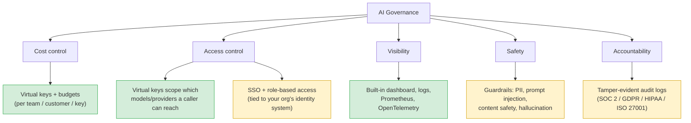

# AI Governance, and What Bifrost Lets You Achieve at Each Tier

*Terms you don't recognize below are in [00-terminologies.md](00-terminologies.md).*

## What "AI governance" actually means

AI governance is just having real answers to a few basic questions about how your org uses AI, instead of every team doing whatever it wants with no oversight:

1. **Cost** — who's spending what, and can any one team or key blow through the budget unchecked?
2. **Access** — who's allowed to call which models or providers, and can you cut them off if needed?
3. **Visibility** — can you actually see what's being sent and received across the org?
4. **Safety** — is unsafe or sensitive content getting blocked before it causes damage?
5. **Accountability** — if something goes wrong, can you prove what happened, to an auditor or regulator?

The most commonly referenced framework for this is **NIST's AI Risk Management Framework**, built around four steps: **Govern** (set the policy and culture), **Map** (understand where AI is actually being used), **Measure** (quantify the risk with real numbers), and **Manage** (actually act on it). Bifrost's features map cleanly onto the practical, day-to-day version of this.

## How this maps onto Bifrost

## What you get for free

**Cost control.** Give each team or use case its own virtual key with a hard budget and rate limit. *Example: give your RAG pipeline's dev environment one virtual key with a $50/month cap, and prod a separate key with a much higher one — a bug in dev can't accidentally rack up your production bill.*

**Basic access control.** A virtual key only reaches the providers/models you scope it to, and you can revoke one key without touching anyone else's.

**Visibility.** The built-in dashboard, Logs API, Prometheus metrics, and OpenTelemetry give you a real picture of what's being called, how often, and at what cost — without writing your own logging.

**Basic tool governance.** The MCP gateway keeps tool registration in one place with filtering, instead of every application deciding for itself what an agent is allowed to touch.

This is genuinely enough for a single team that wants cost discipline and visibility but has no compliance requirement — exactly the kind of setup our notebook uses.

## What needs Enterprise

**Actually checking content, not just usage.** Free-tier governance controls *who can spend how much*. It does not look at *what's actually being said*. Guardrails (PII detection, prompt-injection detection, content-safety filtering) are the part that inspects the real content of a request or response.

*RAG example:* imagine your RAG knowledge base includes internal documents that mention employee salaries. Free-tier virtual keys can control *which team* can query that index — but only a guardrail can catch and redact a salary figure that shows up in the model's *answer* before it reaches the end user.

**Access tied to your real org structure.** SSO (SAML/OIDC) and RBAC connect gateway access to your actual identity system and roles, instead of you manually handing out and tracking virtual keys one by one.

**Proof, not just logs.** Free-tier logs tell you what happened. Enterprise audit logs are built specifically to be trusted by an outside auditor for SOC 2, GDPR, HIPAA, or ISO 27001.

**Per-identity tool permissions.** *Agent example:* with the free MCP gateway, every agent behind it shares the same tool-access policy. With federated auth, the support team's agent can query a customer database tool, while the marketing team's agent — going through the exact same gateway — simply can't.

**Getting logs out to your own systems.** Pushing logs and traces into an external SIEM or compliance pipeline, instead of only viewing them inside Bifrost's own dashboard.

## Governance capability by tier

| Governance pillar | How Bifrost does it | Free | Enterprise |
|---|---|:---:|:---:|
| Cost | Virtual keys, budgets, rate limits | ✅ | ✅ |
| Access (per key) | Scoping and revoking virtual keys | ✅ | ✅ |
| Access (org-wide) | SSO, role-based permissions | ❌ | ✅ |
| Visibility | Dashboard, logs, Prometheus, OTel | ✅ | ✅ (+ export to your own tools) |
| Safety | Guardrails: PII, injection, content safety, hallucination | ❌ | ✅ |
| Tool governance | MCP gateway with filtering | ✅ (shared policy) | ✅ (per-identity) |
| Accountability | Audit trail built for outside auditors | ❌ | ✅ |

## The honest summary

The free tier gives you **operational** governance — you can see what's happening and control who spends what. Enterprise adds **content** governance and **compliance** governance — controlling what the model is allowed to say or see, and being able to prove that control actually held. If your worry is "someone might run up a huge bill" or "I have no idea what's being called," the free tier already solves it. If your worry is "this model might leak something it shouldn't" or "we need SOC 2 to close a deal," that's exactly where Enterprise stops being optional.

## Sources

- [NIST AI Risk Management Framework](https://www.nist.gov/itl/ai-risk-management-framework)
- [Bifrost Pricing — OSS and Enterprise](https://www.getmaxim.ai/bifrost/pricing)
- [Bifrost Guardrails — Enterprise AI Safety & Policy Enforcement](https://www.getmaxim.ai/bifrost/resources/guardrails)
- [Best AI Governance Platform for PII Redaction and Guardrails](https://www.getmaxim.ai/articles/best-ai-governance-platform-for-pii-redaction-and-guardrails/)
