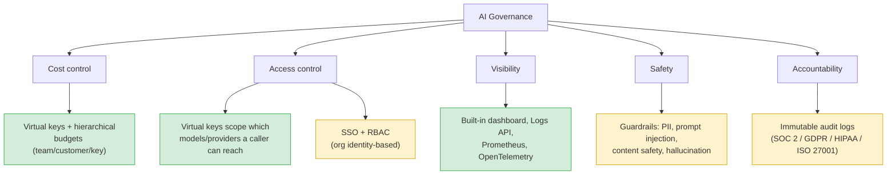

# AI Governance, and What Bifrost Lets You Achieve at Each Tier

## What "AI governance" actually means

AI governance is the set of policies, controls, and processes that ensure AI systems are used **safely, cost-effectively, accountably, and in compliance with regulation** — as opposed to every team calling model APIs however they want with no shared oversight. It's the same instinct as IT governance or data governance, applied to a category of infrastructure that's newer and riskier because its behavior isn't fully predictable and its inputs/outputs are unstructured text.

The most widely referenced framework is **NIST's AI Risk Management Framework (AI RMF)**, built around four functions:

- **Govern** — organizational culture, leadership accountability, and policy for how AI is used
- **Map** — understanding where and how AI systems are deployed, and their context/impact
- **Measure** — quantifying risk (bias, safety, reliability) with real metrics
- **Manage** — actually responding to and mitigating identified risks

In practice, for a team running LLMs in production, governance breaks down into five concrete, answerable questions:

1. **Cost** — who's spending what, and can any team/key blow the budget unchecked?
2. **Access** — who is allowed to call which models/providers, and can that be revoked?
3. **Visibility** — can you see what's actually being sent and received across the org?
4. **Safety** — is unsafe or sensitive content being blocked before it does damage?
5. **Accountability** — if something goes wrong, can you prove what happened and when, for an auditor or regulator?

## Mapping governance to Bifrost

## What's achievable on the free (OSS) tier

Bifrost's free tier already covers real governance, not just routing:

- **Cost governance** — virtual keys carry their own budget and rate limit, at team/customer/key granularity. You can hand a teammate a key that hard-caps their spend without touching anyone else's.
- **Basic access governance** — a virtual key scopes exactly which providers/models a caller can reach; revoking one key doesn't require rotating the shared provider credential everyone else uses.
- **Usage visibility** — the built-in dashboard, Logs API, Prometheus metrics, and OpenTelemetry give you a real picture of what's being called, by whom, how often, and at what latency/cost — without adding your own logging.
- **Tool governance (basic)** — the MCP gateway centralizes which tools are registered and available to agents, with tool filtering, instead of every application independently deciding what an agent can touch.

This is enough for a single team or small org that wants cost discipline and observability but doesn't have a compliance mandate.

## What requires Enterprise

- **Safety governance** — the guardrails system (PII detection/redaction, prompt-injection detection, content-safety filtering, hallucination detection) is what actually inspects and controls *content*, not just usage. Free-tier governance controls *who can spend how much*; it does not control *what gets said*.
- **Organizational access governance** — SSO (SAML/OIDC via Okta, Entra ID) and RBAC tie gateway access to your real identity system and role structure, instead of virtual keys being manually distributed and tracked.
- **Accountability / compliance evidence** — immutable audit logs suitable as SOC 2, GDPR, HIPAA, and ISO 27001 evidence. Free-tier logs tell you *what happened*; Enterprise audit logs are built to be *trusted by an external auditor*.
- **Federated tool governance** — MCP with per-identity tool permissions, rather than one shared tool-access policy for every agent behind the gateway.
- **Log export** — pushing logs/traces into an external SIEM or compliance pipeline, rather than only viewing them in Bifrost's own dashboard.

## Governance capability by tier

| Governance pillar | Bifrost mechanism | Free (OSS) | Enterprise |
|---|---|:---:|:---:|
| Cost | Virtual keys, hierarchical budgets, rate limits | ✅ | ✅ |
| Access (key-level) | Virtual key scoping, revocation | ✅ | ✅ |
| Access (org-level) | SSO (SAML/OIDC), RBAC | ❌ | ✅ |
| Visibility | Dashboard, Logs API, Prometheus, OTel | ✅ | ✅ (+ external export) |
| Safety | Guardrails: PII, prompt injection, content safety, hallucination | ❌ | ✅ |
| Tool governance | MCP gateway, tool filtering | ✅ (basic) | ✅ (+ federated auth) |
| Accountability | Immutable, compliance-grade audit trail | ❌ | ✅ |

## The honest summary

Free-tier Bifrost gives you **operational governance** — you can see what's happening and control who spends what. Enterprise adds **content governance and compliance governance** — controlling what the model is allowed to say or see, and proving that control held, to a standard an external auditor accepts. If your risk is "someone runs up a huge bill" or "I have no idea what's being called," the free tier solves it. If your risk is "this model might leak a customer's SSN" or "we need SOC 2 to close an enterprise deal," that's the tier where Enterprise stops being optional.

## Sources

- [NIST AI Risk Management Framework](https://www.nist.gov/itl/ai-risk-management-framework)
- [Bifrost Pricing — OSS and Enterprise](https://www.getmaxim.ai/bifrost/pricing)
- [Bifrost Guardrails — Enterprise AI Safety & Policy Enforcement](https://www.getmaxim.ai/bifrost/resources/guardrails)
- [Best AI Governance Platform for PII Redaction and Guardrails](https://www.getmaxim.ai/articles/best-ai-governance-platform-for-pii-redaction-and-guardrails/)
